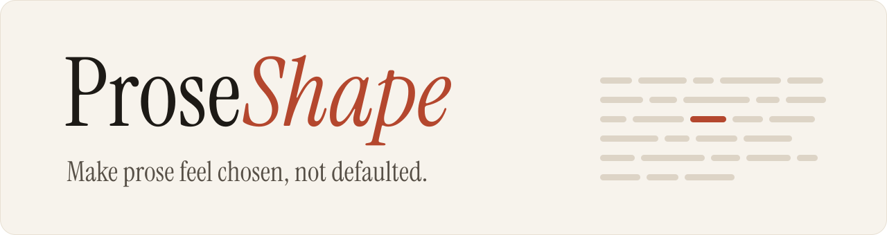

<p align="center">
  <picture>
    <source media="(prefers-color-scheme: dark)" srcset="assets/banner-dark.svg">
    
  </picture>
</p>

ProseShape is an agent skill for writing and rewriting prose while preserving the writer's facts, voice, and intent. It works at two levels: sentence-level patterns that make text feel generic or model-shaped, and narrative-level defaults such as over-explained themes, tidy single-track plots, embodied-emotion repetition, and overly resolved endings.

It is built for readers, not AI detectors. The goal is better, more deliberate prose—not detector evasion.

## What it does

- Rewrites prose without inventing facts, names, numbers, quotations, citations, or personal experiences.
- Matches a supplied writing sample when voice matching matters.
- Handles fiction at both the prose and story-structure level.
- Supports light edits, ordinary rewrites, deep fiction restructuring, and generation from scratch.
- Preserves technical meaning in factual and technical writing.
- Ships with a preservation checker, a frozen held-out corpus, and a reproducible blind-evaluation harness.

## Why ProseShape

Most "humanizer" tools focus on surface wording. ProseShape combines that layer with research on narrative structure. The result is a writing skill that asks not only *which words sound generic?* but also *which choices in the piece were inherited from a model's defaults?*

The core principle is simple: a language model tends toward choices that work for many possible readers and situations; a writer chooses for this reader, this situation, and this piece.

## Install

### Claude Code

ProseShape is a Claude Code plugin. Inside a session, run:

```text
/plugin marketplace add Aieda1l/ProseShape
/plugin install proseshape@proseshape
```

From your shell, run `claude plugin marketplace add Aieda1l/ProseShape`, then `claude plugin install proseshape@proseshape`. Later, `claude plugin update proseshape@proseshape` fetches new versions.

Claude uses the skill when a request matches its description. To call it by name, run `/proseshape:proseshape`, or say "use ProseShape".

### claude.ai and the Claude desktop app

Either way works:

- **Add the plugin.** In **Customize > Plugins**, add the marketplace `Aieda1l/ProseShape` and install ProseShape. A plugin added to your account also appears in your Claude Code sessions.
- **Upload the skill.** Download `proseshape-<version>.zip` from the [latest release](https://github.com/Aieda1l/ProseShape/releases/latest), upload it under **Customize > Skills**, and turn it on.

### Codex

ProseShape is also a Codex plugin. From your shell:

```bash
codex plugin marketplace add Aieda1l/ProseShape
codex plugin add proseshape@proseshape
```

`codex plugin marketplace upgrade proseshape` fetches new versions. In a session, `/skills` lists ProseShape, or ask Codex to "use ProseShape".

To install only the skill instead, copy `plugins/proseshape/skills/proseshape/`, or the `proseshape/` folder from the release zip, into `~/.agents/skills/` for all your projects or into a repository's `.agents/skills/` for one.

### Cursor, Gemini CLI, GitHub Copilot, and other agents

ProseShape follows the open [Agent Skills](https://agentskills.io) format, so the same folder works in any tool that supports it. Copy `plugins/proseshape/skills/proseshape/`, or the `proseshape/` folder from the release zip, into the skills folder your tool reads. Each tool's documentation gives the location: [Cursor](https://cursor.com/docs/context/skills), [Gemini CLI](https://geminicli.com/docs/cli/skills/), [GitHub Copilot](https://docs.github.com/en/copilot/concepts/agents/about-agent-skills), [VS Code](https://code.visualstudio.com/docs/copilot/customization/agent-skills).

### Claude Code without the plugin

```bash
git clone https://github.com/Aieda1l/ProseShape.git
cp -r ProseShape/plugins/proseshape/skills/proseshape ~/.claude/skills/proseshape
```

This installs it as a personal skill that you run with `/proseshape`. To install it for one project only, copy the folder into that project's `.claude/skills/proseshape` instead.

**Upgrading from an earlier install:** the skill used to sit at the root of this repository. If you cloned the whole repository into `~/.claude/skills/proseshape`, remove that folder and reinstall with one of the methods above.

## Example prompts

```text
Humanize this story. Same events, same ending. [paste]
```

```text
The prose is fine but this story feels AI-shaped. Free rein to restructure; keep the characters and premise. [paste]
```

```text
Here are two things I wrote: [samples]. Rewrite this draft so it sounds like me: [draft]
```

```text
Light polish only. Keep every fact and citation exactly as-is. [paste]
```

```text
Write a 1,200-word story about a hospice night nurse. No stated moral, no years-later ending.
```

If Claude answers without the skill, ask again and name it ("Use ProseShape to humanize this…").

## Repository layout

```text
.
├── .claude-plugin/
│   └── marketplace.json          # lets Claude Code and claude.ai install the plugin from this repository
├── .agents/plugins/
│   └── marketplace.json          # the same for Codex
├── plugins/proseshape/           # the plugin: everything a user installs
│   ├── .claude-plugin/plugin.json    # Claude manifest
│   ├── plugin.json               # portable manifest with Codex display details
│   ├── assets/icon.svg           # plugin icon
│   ├── README.md                 # the plugin's listing text
│   ├── LICENSE, THIRD_PARTY_NOTICES.md   # copies of the root files
│   └── skills/proseshape/
│       ├── SKILL.md              # the skill (runtime entry point)
│       ├── agents/openai.yaml    # how Codex's skill picker shows it
│       └── references/           # loaded by the skill as needed
│           ├── humanizer-rules.md
│           ├── storyscope-rules.md
│           ├── mode-guidance.md
│           ├── examples.md
│           ├── evaluation-rubric.md
│           └── prompt-engineering-notes.md   # maintainers only
├── scripts/
│   ├── preserve_check.py         # did a rewrite keep numbers, quotes, code, links, structure?
│   ├── package_skill.py          # checks the plugin and builds the release zip
│   └── tests/
├── evals/
│   ├── eval-log.md               # every tested version and its result
│   ├── trigger-evals.json
│   ├── files/                    # inputs for the 1.0–1.3 evaluations
│   ├── heldout/, heldout2/       # frozen held-out corpora (SHA256SUMS)
│   ├── harness/                  # generate, blind-judge, analyze, check
│   └── v1.4-validation/, v1.4.1-validation/   # method, results, raw outputs and judgments
├── docs/
│   ├── publishing.md             # how to release and submit to Anthropic's directory
│   └── research/                 # competitive analysis and the 2026-09 experiment
├── .github/workflows/            # CI checks; release builds the skill zip
├── assets/                       # banner and icon, light and dark (icon also as 1024 px PNG)
├── CHANGELOG.md
├── THIRD_PARTY_NOTICES.md
└── LICENSE
```

Only `plugins/proseshape/` is needed at runtime. Raw outputs and judgments for the 1.0–1.3 iterations stayed in the private build workspace. For the 2026-09 comparison and the 1.4 and 1.4.1 validations they are committed, so every table can be reproduced without a model call.

## Evidence base

ProseShape combines and adapts two main sources:

1. **Humanizer** by Siqi Chen (`blader/humanizer`, MIT), for sentence- and discourse-level patterns, preservation rules, and the idea of editing away generic model defaults.
2. **StoryScope: Investigating idiosyncrasies in AI fiction** by Jenna Russell, Rishanth Rajendhran, Chau Minh Pham, Mohit Iyyer, and John Wieting (2026), for research on discourse-level narrative differences in AI and human fiction.

StoryScope paper: https://arxiv.org/abs/2604.03136  
StoryScope code: https://github.com/jenna-russell/storyscope  
Humanizer: https://github.com/blader/humanizer

StoryScope findings are population-level observations, not rules for what human writing must look like. ProseShape uses them to question defaults, not to enforce quotas or manufacture randomness.

## Evaluation

ProseShape is measured against the edit a capable model makes when simply told to edit well. Detector scores are not the benchmark.

**1.4.0 against a strong ordinary-editor prompt.** There were 12 held-out texts, frozen before any 1.4 change: release notes, a cover letter, a support reply, a README, an op-ed, a press release with quotations, a personal essay, fiction dialogue, a grant abstract, and three human-written controls. Every arm got the same request and the same executor model, and a stronger model judged the outputs blind, with the untouched source among the candidates.

| Arm | Overall (1–10) [95% CI] | Fact problems flagged |
|---|---|---|
| **ProseShape 1.4.0** | **8.17** [7.79, 8.54] | 16 |
| Ordinary-editor prompt | 7.33 [6.88, 7.79] | 47 |
| HumanScope | 7.27 [6.58, 7.90] | 29 |
| ProseShape 1.3.1 | 5.94 [5.12, 6.75] | 78 |
| Untouched source | 3.75 [2.81, 4.90] | 0 |

Against the ordinary editor, the paired difference is +0.83 [+0.19, +1.54], better on 7 texts, worse on 3, tied on 2.

**That margin did not fully replicate.** On a second set of 15 fresh texts, 1.4.0 led the ordinary editor by only +0.27 [−0.78, +1.22]. Pooled over all 27 held-out texts, the lead is **+0.52 [−0.15, +1.15]**, an interval that includes zero. The pattern was the same in both sets. ProseShape is clearly ahead on AI-shaped drafts (about +0.6 on the second set). It falls behind on text a person already wrote well (about −0.4), because the editor prompt leaves good writing alone more often. See [`evals/v1.4.1-validation/README.md`](evals/v1.4.1-validation/README.md).

The executor and the judge are both Claude models, and no human readers were involved. The method, the per-text results, the known issues and the limitations are in [`evals/v1.4-validation/README.md`](evals/v1.4-validation/README.md). The [competitive analysis](docs/research/competitive-analysis-2026-09.md) explains how the ordinary-editor bar was chosen and how 1.3.1 compared with other open-source humanizers.

**Check a rewrite yourself.** `scripts/preserve_check.py` compares a source with its rewrite. It flags changed or missing numbers, quotations, inline and fenced code, links, and frontmatter, and reports heading, table, length and dash changes. It is standard-library Python and is not a quality score.

```bash
python3 scripts/preserve_check.py draft.md revised.md            # add --mode light, --fiction, --keep "text", --json
python3 -m unittest discover -s scripts/tests
```

Versions 1.0–1.3 were developed on 12 cases covering business prose, personal essays, technical writing, fiction rewrites, dialogue, voice matching, citation preservation, deep story restructuring, minimal editing, and generation. See [`evals/eval-log.md`](evals/eval-log.md). Deep rewrite, generation and voice matching have not yet been re-tested under the 1.4 harness. A 1.4.1 candidate that halves fact problems but reads slightly less naturally is documented in `evals/v1.4.1-validation/`. It scored the same as 1.4.0 overall and is not released.

## License

ProseShape is released under the MIT License. Portions are adapted from `blader/humanizer`, also MIT-licensed; see `THIRD_PARTY_NOTICES.md` for the required notice and research attribution.
